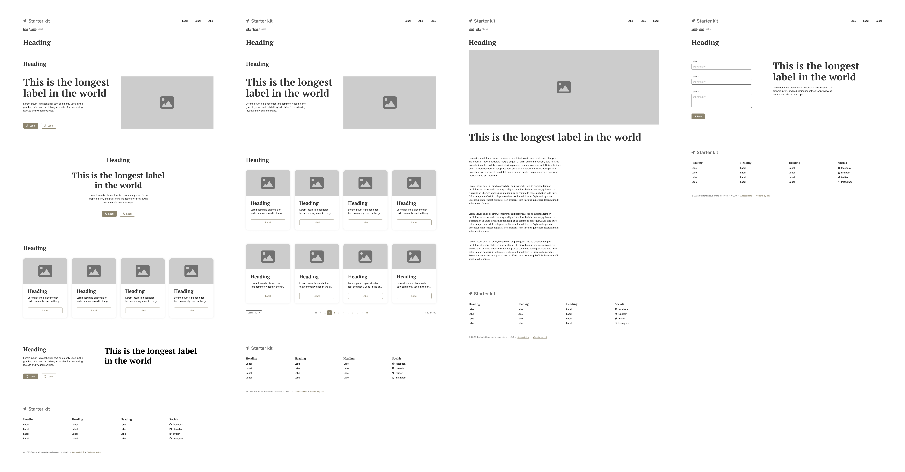

# Template Generic Eleventy



A handmade, artisanal design system for premium showcase websites and blogs.
Built as an alternative to no-code solutions, it combines guaranteed performance metrics
(Lighthouse 100/100, WCAG 2.2 AA, EcoIndex A) with full customization control.

Starting from a modular skeleton, teams can rapidly build client projects while maintaining
technical excellence in accessibility, UX, security, and eco-design.

## Quick Start

### 1. Clone and install

```bash
git clone https://github.com/charlotte-carpentier/template-generic-eleventy.git
cd template-generic-eleventy
npm install
```

### 2. Configure your site

Edit `src/_data/site.json` to customize site title, description, and URL.  
See [Configuring Site](./docs/01-starting/01-configuring-site.md) for details.

### 3. Start developing

```bash
npm start  # http://localhost:8080
```

## Features

- Static site generation with Eleventy 3.0
- Atomic Design components (Nunjucks macros)
- TailwindCSS v4 utility-first styling
- WCAG 2.2 AA compliant (Lighthouse 100/100)
- Eco-designed (EcoIndex Grade A, RGESN 2024)
- Decap CMS for content management
- Optional integrations: Google Fonts, Font Awesome, GA4, Axeptio

## Project Structure

```text
template-generic-eleventy/
├── docs/          # Documentation
├── src/
│   ├── _data/     # Component data (JSON)
│   ├── _includes/ # Nunjucks templates
│   ├── assets/    # Styles, scripts, images
│   └── pages/     # Site pages
└── public/        # Build output
```

## Documentation

HAT documentation is organized in 3 sections:

### Getting Started

- [Configuring Site](./docs/01-starting/01-configuring-site.md)
- [Accessibility Standards](./docs/01-starting/02-accessibility-standards.md)

### Daily Usage

- [Site Configuration Reference](./docs/02-using/01-site-configuration-reference.md)
- [Loading Data](./docs/02-using/02-loading-data.md)
- [Structuring Data](./docs/02-using/03-structuring-data.md)
- [Styling Components](./docs/02-using/04-styling-components.md)
- [Using Scripts](./docs/02-using/05-using-scripts.md)
- [Using Components](./docs/02-using/06-using-components.md)
- [Managing Content](./docs/02-using/07-managing-content.md)
- [Quick Reference](./docs/02-using/08-quick-reference.md)
- [Troubleshooting](./docs/02-using/09-troubleshooting.md)

### Maintenance

- [Deployment](./docs/03-maintaining/deployment.md)
- [Maintenance](./docs/03-maintaining/maintenance.md)
- [Security](./docs/03-maintaining/security.md)
- [Roadmap](./docs/03-maintaining/roadmap.md)
- [Contributors](./docs/03-maintaining/contributors.md)
- [Architecture Decisions](./docs/03-maintaining/decisions/)

## Contributing

Contributions are welcome! See contributing guidelines and test locally before submitting.

## License

MIT © HAT Design System Contributors  
See [LICENSE](./LICENSE) for details.

## Resources

- [Eleventy Documentation](https://www.11ty.dev/docs/)
- [TailwindCSS v4 Documentation](https://tailwindcss.com/docs)
- [Nunjucks Documentation](https://mozilla.github.io/nunjucks/)
- [Decap CMS Documentation](https://decapcms.org/docs/)
